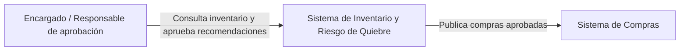
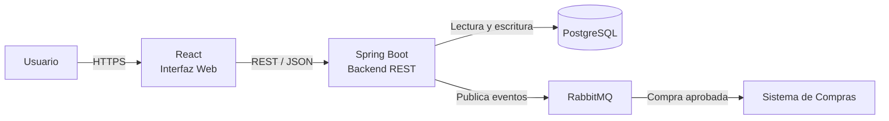
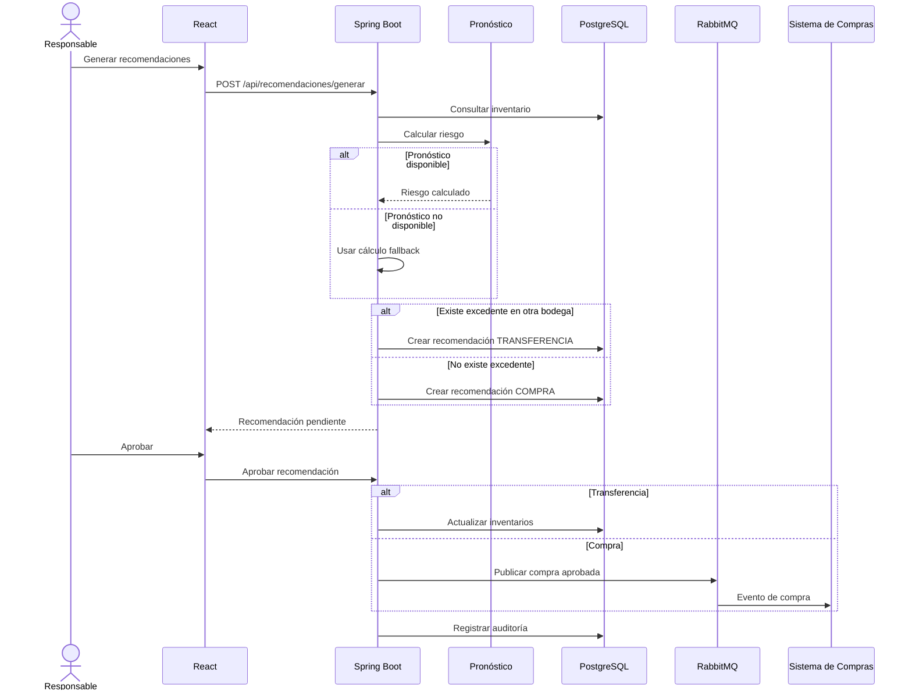

# Inventario y Riesgo de Quiebre

Sistema para una cadena de restaurantes que permite consultar existencias de productos en diferentes bodegas, estimar el riesgo de quiebre de inventario y generar recomendaciones de transferencia o compra que deben ser aprobadas por una persona antes de ejecutarse.

---

## 1. Objetivo

El objetivo del sistema es reducir los quiebres de inventario y las compras urgentes mediante la detección anticipada de productos con riesgo de agotarse.

El sistema analiza el stock disponible y el consumo promedio, determina el nivel de riesgo y recomienda una de las siguientes acciones:

- Transferir productos desde otra bodega con disponibilidad.
- Realizar una compra cuando no exista suficiente inventario en otras bodegas.
- No realizar ninguna acción cuando el riesgo sea bajo.

Toda recomendación debe ser aprobada por una persona antes de ser ejecutada.

---

## 2. Actores

### Encargado de bodega

Puede:

- Consultar las existencias.
- Revisar el nivel de riesgo de los productos.
- Consultar las recomendaciones generadas.

### Responsable de aprobación

Puede:

- Revisar recomendaciones.
- Aprobar una transferencia o compra.
- Rechazar una recomendación.

### Sistema de compras

Sistema externo que recibe las solicitudes de compra aprobadas.

### Administrador

Puede revisar:

- Inventario.
- Recomendaciones.
- Auditoría.
- Métricas del sistema.

---

## 3. Alcance

La aplicación incluye:

- Consulta de inventario por producto y bodega.
- Estimación del riesgo de quiebre.
- Generación automática de recomendaciones.
- Transferencias entre bodegas.
- Recomendaciones de compra.
- Aprobación humana.
- Integración asíncrona con el sistema de compras.
- Auditoría.
- Métricas operativas.

La primera versión no incluye:

- Predicciones mediante modelos avanzados de inteligencia artificial.
- Gestión completa de proveedores.
- Facturación.
- Contabilidad.
- Optimización de rutas logísticas.

---

## 4. Requisitos funcionales

### RF01. Consultar inventario

El sistema debe permitir consultar el stock disponible de cada producto por bodega.

### RF02. Calcular riesgo de quiebre

El sistema debe estimar el riesgo utilizando el stock disponible y el consumo promedio diario.

Los niveles considerados son:

- BAJO
- MEDIO
- ALTO

### RF03. Generar recomendaciones

Cuando exista riesgo de quiebre, el sistema debe generar una recomendación.

### RF04. Recomendar transferencias

Si otra bodega tiene suficiente excedente del mismo producto, el sistema debe recomendar una transferencia.

### RF05. Recomendar compras

Si ninguna otra bodega dispone de suficiente inventario, el sistema debe recomendar una compra.

### RF06. Aprobación humana

Una recomendación no debe ejecutarse automáticamente. Debe ser aprobada o rechazada por una persona.

### RF07. Ejecutar transferencia

Cuando una transferencia sea aprobada, el sistema debe actualizar el inventario de la bodega de origen y de destino.

### RF08. Integración con compras

Cuando una compra sea aprobada, el sistema debe generar un evento para el sistema de compras.

### RF09. Auditoría

El sistema debe registrar las principales acciones realizadas sobre inventarios y recomendaciones.

### RF10. Degradación del pronóstico

Si el servicio o cálculo principal de pronóstico no está disponible, el sistema debe utilizar un método alternativo basado en consumo promedio y punto de reposición.

---

## 5. Requisitos de calidad

### Disponibilidad

Una falla del módulo de pronóstico no debe impedir consultar el inventario ni gestionar recomendaciones.

### Consistencia

Las transferencias deben actualizar correctamente el inventario de ambas bodegas.

### Trazabilidad

Las recomendaciones, aprobaciones, rechazos, transferencias y compras deben quedar registradas.

### Usabilidad

El usuario debe poder identificar rápidamente los productos con riesgo BAJO, MEDIO o ALTO.

### Mantenibilidad

Los componentes del sistema deben estar organizados por responsabilidades para facilitar cambios futuros.

### Resiliencia

Una falla temporal del sistema externo de compras no debe hacer que se pierda una compra aprobada.

---

# 6. Arquitectura

## Monolito modular

Se utiliza un **monolito modular con Spring Boot**.

Los principales módulos son:

- Inventario.
- Pronóstico.
- Recomendaciones.
- Aprobación.
- Auditoría.
- Integración con compras.

Se eligió esta arquitectura porque el sistema todavía tiene un alcance moderado y sus módulos están fuertemente relacionados.

Utilizar microservicios desde la primera versión introduciría complejidad adicional en:

- Despliegue.
- Comunicación entre servicios.
- Observabilidad.
- Consistencia de datos.
- Gestión de fallos distribuidos.

La separación modular permite que ciertos componentes puedan convertirse en microservicios posteriormente si aumenta el volumen.

---

# 7. Diagrama C4 — Contexto



El sistema centraliza la información de inventario y permite a los responsables tomar decisiones antes de ejecutar una transferencia o compra.

---

# 8. Diagrama C4 — Contenedores



### Contenedores

**React**

Proporciona la interfaz web para consultar inventario, visualizar riesgos y aprobar recomendaciones.

**Spring Boot**

Contiene la lógica del negocio:

- inventario,
- pronóstico,
- recomendaciones,
- aprobación,
- auditoría,
- integración.

**PostgreSQL**

Almacena inventario, recomendaciones y registros de auditoría.

**RabbitMQ**

Permite desacoplar la aplicación del sistema externo de compras.

---

# 9. Flujo de operación crítica

La operación crítica seleccionada es la **gestión de un producto con riesgo de quiebre**.



---

# 10. Stack propuesto

## Spring Boot

Se utiliza para desarrollar el backend y la lógica del negocio.

Se eligió porque permite:

- Crear APIs REST fácilmente.
- Integrarse con PostgreSQL.
- Integrarse con RabbitMQ.
- Organizar la aplicación en módulos.
- Gestionar transacciones.

## React

Se utiliza para la interfaz web.

Permite desarrollar una interfaz dinámica para mostrar:

- inventario,
- riesgos,
- recomendaciones,
- métricas,
- auditoría.

## PostgreSQL

Se utiliza como base de datos relacional.

Es adecuado porque la información de inventario y las recomendaciones requieren consistencia y relaciones entre datos.

## RabbitMQ

Se utiliza para la comunicación asíncrona con el sistema de compras.

Una compra aprobada puede permanecer en la cola aunque el sistema externo de compras no esté disponible temporalmente.

## REST

React consulta el backend mediante una API REST.

REST es apropiado para operaciones síncronas como:

- consultar inventario,
- consultar recomendaciones,
- aprobar,
- rechazar.

## Docker

Permite ejecutar la aplicación y sus dependencias en contenedores reproducibles.

## Docker Compose

Permite levantar conjuntamente:

- aplicación,
- PostgreSQL,
- RabbitMQ.

## Redis

No se utiliza en esta versión porque no existe una necesidad demostrada de caché.

---

# 11. ADR 001 — Utilizar monolito modular

## Estado

Aceptado.

## Contexto

El sistema necesita módulos de inventario, pronóstico, recomendaciones, aprobación, auditoría e integración.

Era necesario decidir entre microservicios y un monolito modular.

## Decisión

Utilizar un **monolito modular**.

## Justificación

El tamaño inicial del sistema no justifica la complejidad operativa de microservicios.

El monolito modular permite:

- despliegue sencillo,
- transacciones más simples,
- menor complejidad,
- separación lógica entre módulos.

## Consecuencias

Ventajas:

- Desarrollo más sencillo.
- Menos infraestructura.
- Mayor facilidad para mantener consistencia.

Desventajas:

- Toda la aplicación se despliega conjuntamente.
- Los módulos no pueden escalar independientemente.

Si el sistema crece, los módulos de pronóstico o integración podrían separarse.

---

# 12. ADR 002 — Utilizar RabbitMQ para compras aprobadas

## Estado

Aceptado.

## Contexto

El sistema debe integrarse con un sistema de compras existente.

Una comunicación REST directa provocaría dependencia inmediata entre ambos sistemas.

## Decisión

Utilizar **RabbitMQ** para publicar las compras aprobadas.

## Justificación

La compra no necesita ejecutarse dentro de la misma respuesta al usuario.

RabbitMQ permite:

- comunicación asíncrona,
- desacoplamiento,
- tolerancia a fallos temporales,
- procesamiento posterior.

## Consecuencias

Ventajas:

- Si compras está temporalmente fuera de servicio, el mensaje puede permanecer en la cola.
- La aplicación principal no necesita esperar al sistema externo.

Desventajas:

- Se añade un componente adicional a la infraestructura.
- Es necesario supervisar mensajes pendientes o fallidos.

---

# 13. Gestión de riesgos

## Riesgo 1 — Pronóstico no disponible

**Problema:** el cálculo principal de pronóstico puede fallar.

**Mitigación:** utilizar un cálculo de respaldo basado en:

- consumo promedio diario,
- stock actual,
- punto de reposición.

Además, el uso del fallback queda registrado en auditoría.

---

## Riesgo 2 — Sistema de compras fuera de servicio

**Problema:** una compra puede ser aprobada cuando el sistema externo no está disponible.

**Mitigación:** publicar la compra mediante RabbitMQ para que pueda ser procesada posteriormente.

---

## Riesgo 3 — Recomendación incorrecta

**Problema:** un cálculo automático podría generar una recomendación inadecuada.

**Mitigación:** ninguna recomendación se ejecuta automáticamente. Una persona debe aprobarla antes de modificar inventario o solicitar una compra.

---

# 14. Métricas

## Métrica de negocio

### Compras urgentes

Cantidad de compras generadas como consecuencia de productos con riesgo ALTO.

**Objetivo:** reducir progresivamente las compras urgentes mediante una detección más temprana de riesgo de quiebre.

También se observan:

- quiebres por producto,
- porcentaje de recomendaciones aceptadas.

---

## Métrica técnica

### Tiempo de aprobación

Tiempo transcurrido entre la generación de una recomendación y la decisión de aprobarla o rechazarla.

Permite identificar retrasos en el proceso de decisión.

---

# 15. Funcionalidad implementada

La aplicación permite:

- Consultar existencias por bodega.
- Estimar riesgo de quiebre.
- Recomendar transferencias.
- Recomendar compras.
- Aprobar o rechazar recomendaciones.
- Ejecutar transferencias.
- Publicar compras mediante RabbitMQ.
- Utilizar un cálculo de respaldo si falla el pronóstico.
- Registrar auditoría.
- Mostrar métricas.

---

# 16. Ejecución

## Requisitos

Es necesario tener instalado:

- Docker Desktop.
- Docker Compose.

## Levantar la aplicación

Desde la raíz del proyecto:

```bash
docker compose up --build
```

Abrir:

```text
Aplicación:
http://localhost:8080

RabbitMQ:
http://localhost:15672
```

Para detener:

```bash
docker compose down
```

---

# 17. Probar caída del pronóstico

En el archivo `.env`, cambiar:

```env
FORECAST_ENABLED=false
```

Reiniciar:

```bash
docker compose down
docker compose up --build
```

Al generar nuevas recomendaciones, el sistema utilizará el mecanismo de respaldo y registrará el evento en auditoría.

Para restaurar el comportamiento normal:

```env
FORECAST_ENABLED=true
```